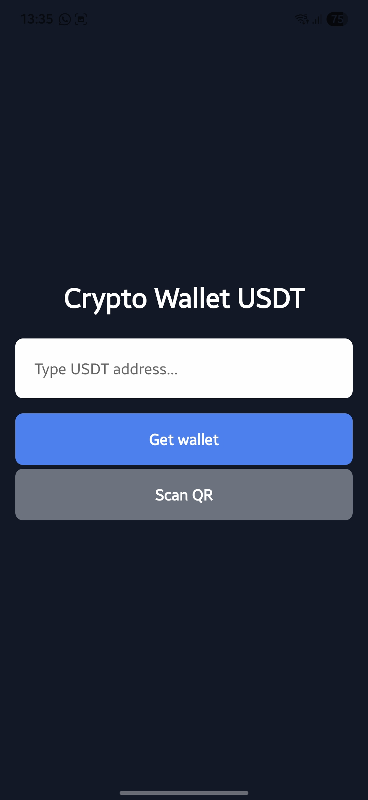
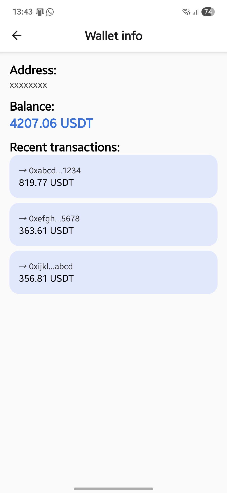

# 📱 TRON Crypto Wallet App

A **simple TRON-based USDT crypto wallet mobile app**, built with **React Native (Expo)** and **TypeScript**. This app allows you to:

- Scan TRON wallet addresses using a QR code.
- Simulate real-time TRX balance of any address (mocked).
- Simulate a transaction history (mocked).
- Learn how to interact with the TRON blockchain using `tronweb`.

> 🔐 This app is **for educational and portfolio purposes only**. It does **not store private keys** or perform actual transactions.

---

## 📸 Screenshots

| Home | Wallet |
|------|--------|
|  |  |

---

## 🧩 Features

- ✅ QR code scanner for TRON wallet addresses (`expo-camera`)
- ✅ Real-time TRON wallet address validation using `tronweb`
- ✅ Navigation via `expo-router`
- ✅ Clean, scalable TypeScript code

---

## ⚙️ Tech Stack

- **React Native (Expo)**
- **TypeScript**
- **TronWeb**
- **expo-camera**
- **expo-router**
